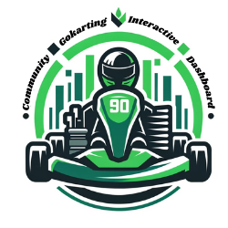

<!-- PROJECT LOGO -->
 

  

  <h3 align="center">Community GoKarting Interactive Dashboard</h3>

  

    A Dashboard that pulls Data from RaceFacer website to display data!
     
    <a href="">View Demo</a>
    ·
    <a href="">Report Bug</a>
    ·
    <a href="">Request Feature</a>
  

<!-- ABOUT THE PROJECT -->
## About The Project

[![Product Name Screen Shot][Dashboard-preview]][Next-url]

### Status
Currently, this project is in a very alpha build. I am just working the bear minimum as I learn CSS, Dash and HTML from scratch. This dashboard is likely to be redesigned multiple times.

### Built With

* [![Python][Python.py]][Next-url]
* [![CSS][CSS.CSS]][Next-url]
* [![Pandas][Pandas]][Next-url]
* [![Selenium][Selenium]][Next-url]
* [![NumPy][NumPy]][Next-url]
* [![Dash][Dash]][React-url]

<!-- GETTING STARTED -->
## Getting Started

As this is in development, all you have to do is run app.py and open the link it gives you. 

<!-- ROADMAP -->
## Roadmap
- [x] Create pre alpha version to understand Dash framework
- [x] Redesign dashboard
- [x] Add driver data with friends for now
- [x] Add README.md
- [ ] Fix small bugs to make the dashboard usable
- [ ] Work on the scraper to be more user friendly
- [ ] Integrate data scraper into the website (likely have to use another library for scraping)
- [ ] Redesign website again with frameworks

### Resources

* https://dash.plotly.com/dash-html-components/a 
* https://dash-bootstrap-components.opensource.faculty.ai/docs/components/accordion/
* https://codepen.io/mobify/pen/DRyBoB
* https://www.w3schools.com/cssref/index.php
* https://www.figma.com/file/EF9qumRJ1SchLQSR38QLhP/Go-Karting-Dashboard-Design?type=design&node-id=0%3A1&mode=design&t=uyQ8tzv5UN6F2zFt-1
<!-- CONTACT -->
## Contact

Mitchell Whitten- [@SketchyR6](https://twitter.com/SketchyR6) - mitchyw87@gmail.com

(<a href="#readme-top">back to top</a>)

<!-- MARKDOWN LINKS & IMAGES -->
<!-- https://www.markdownguide.org/basic-syntax/#reference-style-links -->
[contributors-shield]: https://img.shields.io/github/contributors/othneildrew/Best-README-Template.svg?style=for-the-badge
[contributors-url]: https://github.com/othneildrew/Best-README-Template/graphs/contributors
[forks-shield]: https://img.shields.io/github/forks/othneildrew/Best-README-Template.svg?style=for-the-badge
[forks-url]: https://github.com/othneildrew/Best-README-Template/network/members
[stars-shield]: https://img.shields.io/github/stars/othneildrew/Best-README-Template.svg?style=for-the-badge
[stars-url]: https://github.com/othneildrew/Best-README-Template/stargazers
[issues-shield]: https://img.shields.io/github/issues/othneildrew/Best-README-Template.svg?style=for-the-badge
[issues-url]: https://github.com/othneildrew/Best-README-Template/issues
[license-shield]: https://img.shields.io/github/license/othneildrew/Best-README-Template.svg?style=for-the-badge
[license-url]: https://github.com/othneildrew/Best-README-Template/blob/master/LICENSE.txt
[linkedin-shield]: https://img.shields.io/badge/-LinkedIn-black.svg?style=for-the-badge&logo=linkedin&colorB=555
[linkedin-url]: https://linkedin.com/in/othneildrew
[product-screenshot]: images/screenshot.png
[Next.js]: https://img.shields.io/badge/next.js-000000?style=for-the-badge&logo=nextdotjs&logoColor=white
[Next-url]: https://nextjs.org/
[React.js]: https://img.shields.io/badge/React-20232A?style=for-the-badge&logo=react&logoColor=61DAFB
[React-url]: https://reactjs.org/
[Vue.js]: https://img.shields.io/badge/Vue.js-35495E?style=for-the-badge&logo=vuedotjs&logoColor=4FC08D
[Vue-url]: https://vuejs.org/
[Angular.io]: https://img.shields.io/badge/Angular-DD0031?style=for-the-badge&logo=angular&logoColor=white
[Angular-url]: https://angular.io/
[Svelte.dev]: https://img.shields.io/badge/Svelte-4A4A55?style=for-the-badge&logo=svelte&logoColor=FF3E00
[Svelte-url]: https://svelte.dev/
[Laravel.com]: https://img.shields.io/badge/Laravel-FF2D20?style=for-the-badge&logo=laravel&logoColor=white
[Laravel-url]: https://laravel.com
[Bootstrap.com]: https://img.shields.io/badge/Bootstrap-563D7C?style=for-the-badge&logo=bootstrap&logoColor=white
[Bootstrap-url]: https://getbootstrap.com
[JQuery.com]: https://img.shields.io/badge/jQuery-0769AD?style=for-the-badge&logo=jquery&logoColor=white
[JQuery-url]: https://jquery.com 
[Dashboard-preview]: assets/Images/preview.png
[Python.py]: https://img.shields.io/badge/python-3670A0?style=for-the-badge&logo=python&logoColor=ffdd54
[CSS.css]: https://img.shields.io/badge/css3-%231572B6.svg?style=for-the-badge&logo=css3&logoColor=white
[plotly]: https://img.shields.io/badge/Plotly-%233F4F75.svg?style=for-the-badge&logo=plotly&logoColor=white
[Selenium]: https://img.shields.io/badge/-selenium-%43B02A?style=for-the-badge&logo=selenium&logoColor=white
[Pandas]: https://img.shields.io/badge/pandas-%23150458.svg?style=for-the-badge&logo=pandas&logoColor=white
[Dash]: https://img.shields.io/badge/dash-008DE4?style=for-the-badge&logo=dash&logoColor=white
[NumPy]: https://img.shields.io/badge/numpy-%23013243.svg?style=for-the-badge&logo=numpy&logoColor=white